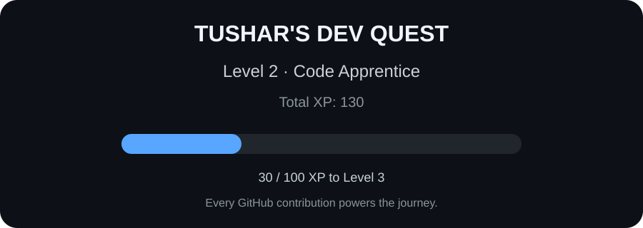

<div align="center">

# Hey, I'm Tushar 👋

### Developer • Problem Solver • Builder


</div>

<br/>

## 👨‍💻 About Me

```cpp
class Tushar {
public:

    vector<string> languages = {
        "C++", "Python", "JavaScript", "SQL"
    };

    vector<string> frontend = {
        "HTML", "CSS", "React"
    };

    vector<string> backend = {
        "Flask", "FastAPI"
    };

    vector<string> databases = {
        "MongoDB"
    };

    vector<string> interests = {
        "Backend Development",
        "Full Stack Development",
        "Data Structures & Algorithms"
    };
};
'''
<p align="left">  </p>
<div align="center">
💻 100+ Problems Solved on LeetCode
🧩 Data Structures & Algorithms
🏆 Participated in Multiple Hackathons
</div>
Every GitHub contribution adds XP to my developer journey.

<div align="center">  </div>
<div align="center">


</div>
<div align="center">  </div>

